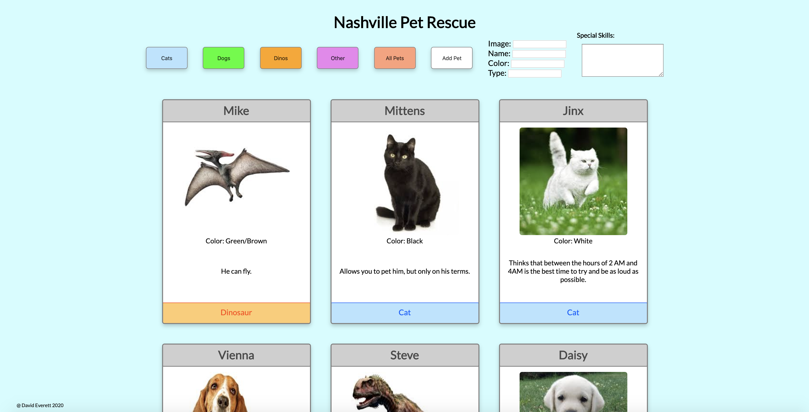

# pet-adoption

## Description
This is a simple application that displays 3 different types of animals (cats, dogs, and dinos) and information about them, on cards that feature footer-sections that are color coded based on animal type.  The animal cards are displayed on the page dynamically using JavaScript.  Each animal is an object contained within a hard-coded array that is looped over and added to a "DOM String", which is then printed to the DOM and into a div acting as a flexbox.  On page load, all animals are displayed, but the user is able to filter which animal type is being displayed by clicking one of the three animal type buttons.  There is also an "Other" button, and a form an with "Add" button that allows the user to add their own animal.  When a user adds a pet, it will be pushed as a new object to the array.  The "Other" button will display the animals the user has added.  "All Pets" will display every pet, even the added ones.
## Screenshot

## How To Run
1. Clone down this repository.
2. Make sure you have http-server installed via npm.  If not get it [HERE](https://www.npmjs.com/package/http-server)
3. On the command line, run `hs -p 8080`.
4. In your browser, to go `http://localhost:8080`.